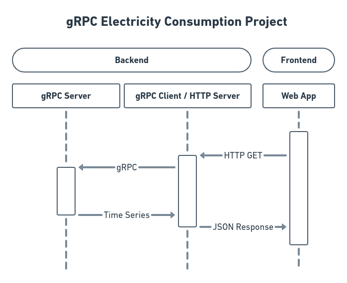
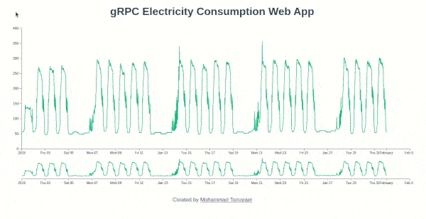

# gRPC Electricity Consumption

## Introduction

This project is an example implementation of a gRPC and HTTP server pair that work in conjunction with a
web app to visualize an electricity consumption time series.

The backend is written in Python, using the gRPC library to serve the meter data and the Tornado framework to
establish an HTTP API that delivers the data in JSON format to the web app.

The frontend web app is written in HTML, CSS, and JavaScript. It is a static, single page application (SPA) built
with Vue.js that uses the Axios HTTP client to receive the meter data and the D3.js library to create an interactive
visualization of the electricity consumption data.

The project uses Docker and Docker Compose to for efficient development and deployment.

This was my first experience with the gRPC library and I finished the assignment in one day.

**Live Demo:** https://demo.tomaraei.com/grpc-electricity-consumption

## Overview





## gRPC

This project takes advantage of the gRPC protocol to stream the electricity consumption usage rather than relying
on bulky requests that, depending on the size of the payload, may fail to maintain integrity of data transfer.

The gRPC protocol incorporates Google's Protocol Buffer technology and long-lived HTTP/2 connections to efficiently
serialize, transfer, and deserialize data of any size.

The Protocol Buffer definitions are located in the `protos` folder of `backend/grpc-server` and contain comments.

To compile them into Python code for the server and client, use the following commands within the root repository
directory (already done):

```shell script
# gRPC Server
python3 -m grpc_tools.protoc \
        -I backend/grpc-server/protos \
        --python_out=backend/grpc-server/src \
        --grpc_python_out=backend/grpc-server/src \
        backend/grpc-server/protos/*.proto

# HTTP Server
python3 -m grpc_tools.protoc \
        -I backend/grpc-server/protos \
        --python_out=backend/http-server/src \
        --grpc_python_out=backend/http-server/src \
        backend/grpc-server/protos/*.proto
``` 

## Development

### Backend

```shell script
docker-compose -f docker-compose-development.yml up
```

To rebuild the images:

```shell script
docker-compose -f docker-compose-development.yml build
```

[BloomRPC](https://github.com/uw-labs/bloomrpc) is a great gRPC client that could save development time and offer a
better understanding of the gRPC protocol.

### Frontend

Node.js and yarn need to be installed for development.

To launch an auto-reloading Node.js server, run the following command in `frontend/web-app`:

```shell script
yarn serve
```   

## Production

```shell script
docker-compose -f docker-compose-production.yml up 
```

To rebuild the images:

```shell script
docker-compose -f docker-compose-production.yml build
````

Alternatively, we may build the images, publish them to a Docker registry and deploy with a slightly modified version
of `docker-compose-production.yml`.

## Testing

The backend gRPC server is automatically tested via Python's unittest library during the Docker build for production.
The test loads the generated protocol buffer definitions, starts a gRPC server, and uses a simple client to retrieve
the list of meter usage data. It looks up and confirms the value of a particular timestamp to ensure all of the
processes are working consistently.

To run the test manually:

```shell script
python3 backend/grpc-server/src/server_test.py
```

## Next Steps

While this project showcases an example use-case of the gRPC protocol, there is plenty of room for improvement. The
meter usage data, which is a time series, can be upgraded from a CSV file into an InfluxDB database. This allows for
better performance due to tag indexing and high-availability storage, and also introduces the possibility of querying
the data based on various criteria such as date/time ranges, additional metadata, and patterns of meter usage values.

Depending on the scale of the project, further unit tests and end-to-end may be implemented.

